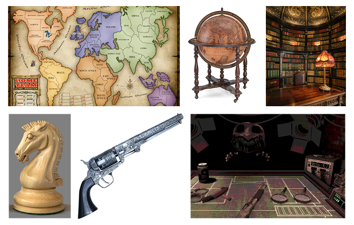
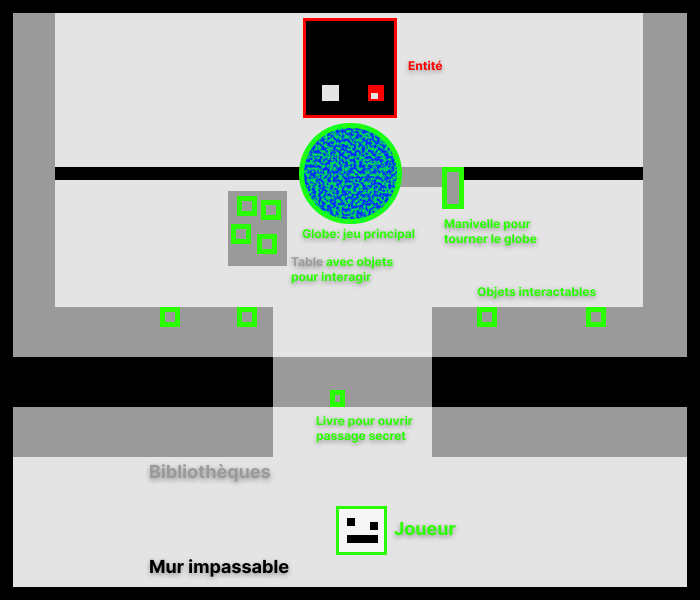
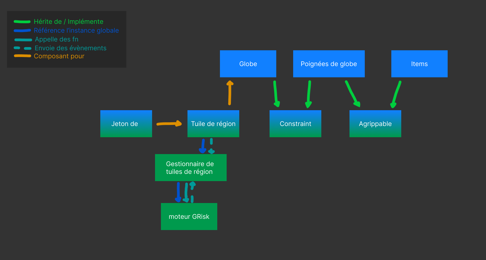

# Atlas Gambit
Atlas Gambit est un jeu de stratégie en réalité virtuelle se déroulant sur un globe 3D, où le joueur contrôle des armées.

## Description
Le joueur se déplace dans une pièce et peut interagir avec des objets interactifs. Il joue à une variante de Risk sans cartes, mais avec des pièces « bonus ». Le joueur commence avec un certain nombre de territoires contrôlés et de troupes sur ces derniers. Il doit affronter une entité (IA) possédant un territoire et un nombre de troupes similaires. Le plateau est un globe tridimensionnel. Le joueur qui conquiert le globe remporte la partie.

Le jeu se divise en une phase de préparation, une phase d'attaque et une phase de fortification. Au lieu de sélectionner un nombre fixe de troupes en fonction du nombre de territoires ou des cartes Territoire, le joueur peut utiliser des éléments externes : des « bonus » disséminés dans la pièce, qui permettent notamment d'ajouter ou de retirer des troupes sur le plateau. Un seul « bonus » est utilisé par tour. Lors de la phase d'attaque, le joueur avance ses troupes en territoire ennemi pour engager le combat. Un dé est lancé sur le globe pour simuler l'escarmouche et déterminer les pertes de troupes. Le joueur ayant des troupes restantes conquiert ou conserve le territoire. Durant la phase de fortification, le joueur peut déplacer un groupe de troupes d'un territoire à un autre.

Liste non exhaustive des « bonus »:

- Couteau : Pour diviser le nombre de troupes, le joueur doit utiliser le couteau. Le nombre de troupes est alors divisé en deux et peut être placé sur un autre territoire. Durabilité infinie. Peut se faire jouer plusieurs fois.

- Revolver : Le joueur peut éliminer la moitié des troupes ennemies sur un autre territoire. Durabilité : 6.

- Grenade : Le joueur peut éliminer toutes les troupes ennemies sur un autre territoire, mais ne la capture pas. Objet à usage unique.

- Cheval : Ajoute 1 000 troupes à un territoire. Durabilité infinie.

- Soldat : Ajoute 100 troupes à un territoire. Durabilité infinie.

- Boussole : Permet aux troupes de se téléporter n'importe où (sans tenir compte des territoires adjacents).

- Hache : Met fin à la partie (brise le globe).

## Moodboard

## Carte visuelle

## Schéma de programmation
